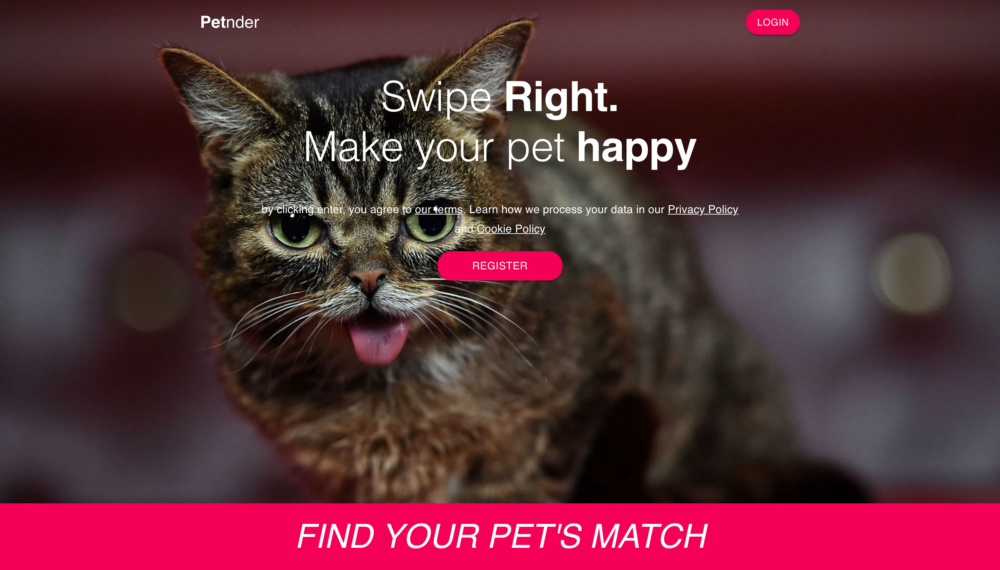
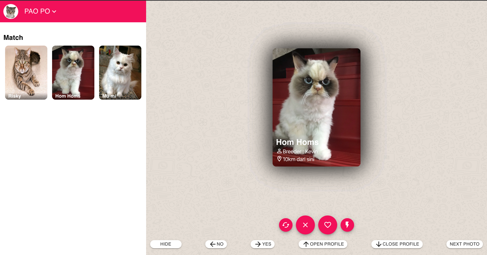
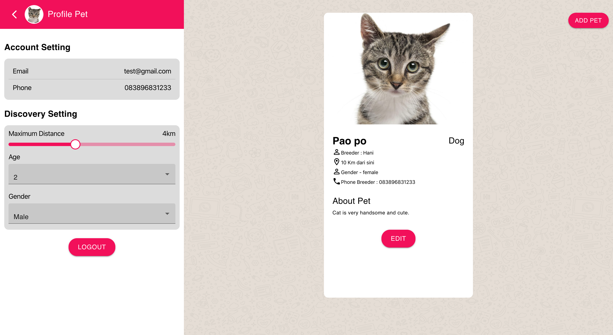

# Petnder

Petnder is application for breeder, find and match other pets.

## Table of Contents

- [Getting Started](#getting-started)
  - [Prerequisites](#prerequisites)
  - [Installation](#installation)
  - [Server Setup](#server-setup)
  - [Client Setup](#client-setup)
- [Screenshots](#screenshots)
- [Built With](#built-with)
- [Author](#author)
- [License](#license)

## Getting Started

Before starting to install the project, there're some things that need to be done first.

### Prerequisites

Make sure all of these are properly installed in your system.

| Application  | Download                                                                            |
| ------------ | ----------------------------------------------------------------------------------- |
| Git          | [Windows](https://gitforwindows.org/) / [Linux](https://git-scm.com/download/linux) / [Mac](https://git-scm.com/download/mac)  |
| Node.js      | [Link](https://nodejs.org/en/download/)                                             |
| MySQL        | [Link](https://www.mysql.com/downloads/)                                            |

### Installation

First, clone this repository into your system.

```
git clone https://github.com/setyawanandik/Petnder_DW14GLU9N.git
```

Then, install all the packages that described in `package.json` of both `client` and `server` directories.

```
npm install
```

### Server Setup

For the server setup, first, make sure your MySQL services is running fine. In `server` directory, you'll find `config.json` inside `config` folder. Open and edit the `development` configuration to match your database setup.

```
  "development": {
    "username": "root",
    "password": null,
    "database": "database_development",
    "host": "127.0.0.1",
    "dialect": "mysql",
    "operatorsAliases": false
  },
```

After completing the database configuration setup, migrate all the required tables.

```
npm run build
```

We also need to configure some environtment variables for the server, let's create .env file in server's root project, open and edit it, then input the code below.

```
PORT=5000
SECRET_KEY=ThisIsTheSecretKey
```

The `SECRET_KEY` and `PORT` you can custom it as you wish.

And for the last step, running the server

```
npm start
```

### Client Setup

Before running the application, we need to configure an environtment variable for the client, let's find .env file in client's root project, open and edit it.

```
REACT_APP_BASE_BACKEND_URL=http://localhost:5000
```
Note that the REACT_APP_BASE_BACKEND_URL above is the address of the server previously run, making sure the ip and port are the same with server address.

Then, run the web application.

`npm run start`

Wait till the application is opened into your browser. Now, you can explore Petnder and its features. Enjoy!

## Screenshots





## Built With

- [React JS](https://reactjs.org/) - Front-end
- [Express JS](https://expressjs.com) - Back-end
- [MySQL](https://www.mysql.com) - Database

## Author

**Andik Setyawan** - [setyawanandik](https://github.com/setyawanandik)

## License

This project is licensed under the GNU General Public v3.0 License - see the [LICENSE](LICENSE) file for details